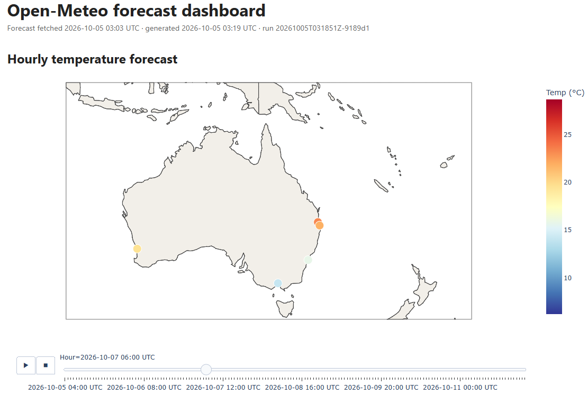

# Open-Meteo Medallion Pipeline

A local, end-to-end data pipeline built on the [Open-Meteo](https://open-meteo.com/) weather API
using a **medallion architecture** (Bronze → Silver → Gold). It ingests weather data for a
configurable set of locations, stores the raw responses, and is designed to transform them into
clean, analysis-ready datasets queryable with SQL.


Forecast dashboard: map of cities colored by hourly temperature, with daily charts.

---

## Architecture

```
Open-Meteo API
      │  extract (retries, timeouts)
      ▼
┌─────────────┐
│   Bronze    │  Raw API responses as JSON, exactly as received, plus request metadata.
│             │  Append-only, never modified. Partitioned by source and ingest date.
└─────────────┘
      │          clean, flatten, validate, deduplicate
      ▼
┌─────────────┐
│   Silver    │  Typed, UTC-normalized Parquet tables.
└─────────────┘
      │          aggregate
      ▼
┌─────────────┐
│    Gold     │  Aggregated, analysis-ready tables.
└─────────────┘
      │
      ▼
   DuckDB / SQL
```


## Getting started

You can run the pipeline with Docker (recommended) or directly with Python.

### Option A: Docker (recommended)


**1. Clone the repository**

```bash
git clone https://github.com/herreraaf/open-meteo-medallion-pipeline.git
cd open-meteo-medallion-pipeline
```

**2. Build the image**

```bash
docker compose build
```

**3. Run the pipeline**

```bash
docker compose run --rm pipeline

docker compose run --rm pipeline python -m pipeline.cli extract   # fetch new data from the API
docker compose run --rm pipeline python -m pipeline.cli silver    # rebuild silver from bronze
docker compose run --rm pipeline python -m pipeline.cli gold      # rebuild gold from silver
docker compose run --rm pipeline python -m pipeline.cli report    # regenerate the dashboard
```

That's it. Results are written to the `data/` folder on your machine (see [Output](#output)). Dashboard is found in `data/report/`

### Option B: Python, without Docker

**Requires:** Python 3.12+ and Git.

**1. Clone the repository**

```bash
git clone https://github.com/herreraaf/open-meteo-medallion-pipeline.git
cd open-meteo-medallion-pipeline
```

**2. Create and activate a virtual environment**

```bash
python -m venv .venv

# Windows (PowerShell)
.venv\Scripts\Activate.ps1

# macOS / Linux
source .venv/bin/activate
```

**3. Install the dependencies and the project**

```bash
python -m pip install -r requirements.txt
python -m pip install -e .
```

**4. Run the pipeline**

```bash
python -m pipeline.cli run
```

Always run commands from the project root: the config and data paths are relative to it.
## Configuration

The pipeline's scope is defined in [`config/locations.yaml`](config/locations.yaml), not in code:

| Setting | Current value |
|---|---|
| Locations | Brisbane, Sydney, Melbourne, Perth, Gold Coast |
| Variables | `temperature_2m`, `precipitation`, `wind_speed_10m` |
| Forecast horizon | 7 days, hourly |

Adding a city or variable is a config change only. With Docker Compose, `config/` is mounted
into the container, so changes apply on the next run without rebuilding the image.

The current locations and variables are a starting set; the scope will be refined once the
analytical use case for the Gold layer is defined.

---

## Design decisions

**Idempotent ingestion.** Each Bronze file is named after a SHA-256 hash of its content. If a
rerun fetches identical data, the file already exists and the write is skipped. If the data has
changed (forecasts are updated several times a day), the new version is saved alongside the old
one, so Bronze keeps a full history of what the API returned over time. The response field
`generationtime_ms` changes on every call, so it is excluded from the hash.

**Retries for temporary errors only.** Timeouts, connection errors, rate limits (429) and server
errors (5xx) are retried with exponential backoff. Other client errors fail immediately, since
retrying a bad request cannot succeed. One failing location does not stop the others.

**UTC everywhere.** All data is requested in UTC so every location shares one clock. Conversion
to local time is left to the presentation layer.


**Right-sized technology.** The data volume is small (a few thousand rows per run), so local
files, Parquet and DuckDB are the appropriate tools. At larger scale, the same layered design
maps onto object storage with Delta Lake or Iceberg and Spark.

---

## Project structure

```
├── config/
│   └── locations.yaml            # Locations the pipeline processes
├── data/                         # Local data output (not tracked)
├── docs/
│   ├── ai_evidence/              # Screenshots of AI tools used in the project
│   │   ├── Claude_Code_Project/  # Claude Code setup and repository creation
│   │   └── Planning and Comparisson - Chats/  # Planning chats comparing ChatGPT, Claude and Qwen
│   └── images/
│       └── dashboard.png         # Dashboard screenshot
├── src/
│   └── pipeline/
│       ├── __init__.py
│       ├── cli.py                # Command-line entry point
│       ├── extract.py            # Raw data extraction (bronze)
│       ├── bronze_to_silver.py   # Cleaning and validation
│       ├── silver_to_gold.py     # Aggregations for reporting
│       └── report.py             # Report / dashboard generation
├── tests/
│   ├── fixtures/
│   │   └── forecast_brisbane.json  # Sample API response for tests
│   ├── conftest.py               # Shared pytest fixtures
│   ├── test_silver.py
│   └── test_gold.py
├── CLAUDE.md                     # Instructions for Claude Code
├── Dockerfile
├── compose.yaml
├── requirements.txt
└── README.md
```

---

## Tests

```powershell
pytest -v
```


---

## Roadmap

- [x] Define the analytical use case for the Gold layer
- [x] Single CLI entry point, Docker setup
- [x] Run tracking (audit log per pipeline run)
- [x] Bronze: forecast ingestion with retries, idempotency and atomic writes
- [x] Silver: flattened, typed, deduplicated Parquet tables with data quality checks
- [x] Gold: aggregated tables for the chosen use case

---

## AI usage

AI tools were used throughout this project for design discussions, code drafting and review.
Material conversations are documented in [`docs/ai_evidence/`](docs/ai_evidence/).

## Known limitations and future improvements

### Data and pipeline

- **Scheduling.** The pipeline currently runs on demand. A daily schedule (cron, Windows Task
  Scheduler, or an orchestrator such as  Airflow) would collect forecast versions
  automatically.
- **Local-day aggregation.** Daily summaries use UTC days. Using each location's timezone would
  make "daily" match local calendar days.
- **Incremental processing.** Silver and Gold are fully rebuilt on every run, which is simple and
  idempotent at the current volume. At larger scale, only new Bronze files would be processed.
- **Wider coverage.** Expanding to world capitals is a configuration change; at that scale,
  batching several locations per API request would reduce the number of calls.
- **Runtime data quality checks.** Gold reports hourly completeness but does not enforce it.
  Next: explicit checks for completeness, uniqueness, value ranges and freshness on every run,
  with a clear policy for which failures stop the pipeline and which only warn.
- **Quarantine.** Rejected Bronze files are logged and counted; moving them to a quarantine
  folder with the rejection reason would make investigation easier.

### Testing and CI

- **More coverage:** Bronze hashing and retry rules, Silver grain and schema, rejection of
  malformed files, and a smoke test of the dashboard.
- **Live API contract test,** skipped by default, to detect changes in Open-Meteo's responses.
- **Continuous integration:** GitHub Actions running the tests and a linter (e.g. `ruff`) on
  every push.

### Scaling path

At much larger volumes, the same layered design maps onto cloud object storage, a table format
such as Delta Lake or Iceberg on top of Parquet, Spark or Databricks for processing, and an
orchestrator for scheduling and retries.
